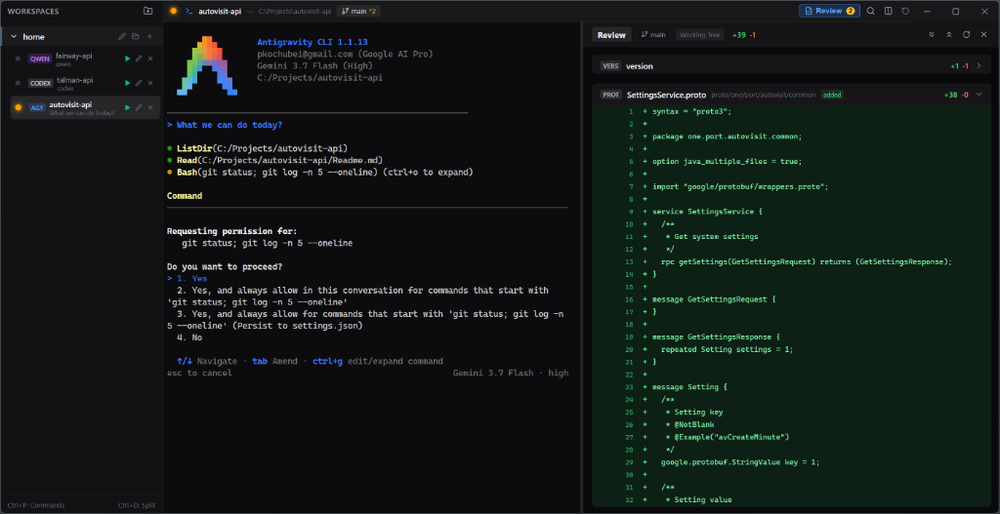

# Termgent

A high-performance Windows terminal and session manager engineered specifically for autonomous AI coding agents: **Qwen Code**, **OpenAI Codex**, **Google Antigravity (AGY)**, **Claude Code**, and **GitHub Copilot CLI**.

<p align="center">
  
</p>

---

## Overview

Traditional terminals treat AI coding agents as generic CLI commands. They lack awareness of whether a model is thinking, when a command execution is awaiting user permission, or how to handle high-frequency terminal animations without flickering.

**Termgent** brings first-class agent orchestration to Windows:
* **Deterministic Status Tracking**: Session state (`active`, `blocked`, `completed`, `idle`) is driven directly by native CLI agent lifecycle hooks.
* **Interactive Approval Prompt Detector**: Detects interactive confirmation prompts (`Allow execution?`, `[y/N]`, `Would you like to run...`) and triggers alerts when user input is required.
* **Interactive Git Diff Review**: Dedicated side-by-side review panel displaying project diffs, additions/deletions statistics, and collapsible line-numbered code hunks.
* **Zero-Flicker WebGL & ConPTY Engine**: Hardware-accelerated terminal rendering with atomic frame batching and scroll-lock protection.
* **Fluid Split Panes & Workspaces**: Live continuous pane resizing, dual-focus controls, fuzzy command palette, and MRU tab switching.

---

## Features

### Deterministic Lifecycle Hooks
Termgent integrates with agent hook systems (`UserPromptSubmitted`, `PreToolUse`, `Stop`, `notify`). Status indicators in the sidebar and top breadcrumbs update deterministically:
* **Blue (Active)**: Agent is processing, searching, or executing tools.
* **Yellow (Blocked)**: Agent is paused awaiting interactive confirmation/approval.
* **Green (Completed)**: Agent finished its turn or task.
* **Gray (Idle)**: Standby terminal state.

### Interactive Approval Prompt Detection
When an agent pauses on `stdin` for confirmation (e.g. creating files, running commands, non-workspace access), Termgent marks the session as `blocked` and sends a native Windows notification. The session automatically returns to `active` once approved. Termgent never steals focus away from your active work.

### Interactive Git Diff Review
Click **Review** in the header, press `Ctrl + Shift + R`, or execute `tg review` to open a side-by-side Git Diff viewer:
* Unified line numbering (old and new line numbers).
* Highlighted additions and deletions with per-file `+N -M` metrics.
* File-by-file collapsible sections with language badges (`TS`, `JS`, `PY`, `RS`, `GO`, `JSON`, `MD`, `CSS`, `HTML`).
* Covers staged changes, unstaged working tree edits, and new untracked files.

### Workspace & Session Management
* Multi-project workspace trees with live Git branch tracking.
* Fast MRU session switching (`Ctrl + Tab`).
* Fuzzy Command Palette (`Ctrl + P`).
* Re-launch button to immediately run the last agent in a session.

---

## Quick Start

### Installation

#### Prebuilt Binary
Download the latest `Termgent-Setup.exe` or portable archive from the [Releases](https://github.com/your-username/termgent/releases) page.

#### Build from Source
```powershell
# Clone the repository
git clone https://github.com/your-username/termgent.git
cd termgent

# Install dependencies and build release
npm install
powershell -ExecutionPolicy Bypass -File .\build-release.ps1
```

The compiled binary will be located at:
```text
release\win-unpacked\termgent.exe
```

---

### Agent Hook Setup

Termgent includes a built-in CLI command to configure native hooks for all detected agents:

```powershell
tg hooks install all
```

This configures:
* **Qwen Code**: `%USERPROFILE%\.qwen\settings.json`
* **OpenAI Codex**: `%USERPROFILE%\.codex\config.toml` and `%USERPROFILE%\.codex\hooks.json`
* **Google Antigravity (AGY)**: `%USERPROFILE%\.gemini\config\hooks.json`
* **Claude Code**: `%USERPROFILE%\.claude\settings.json`

---

## CLI Reference (`tg` / `termgent`)

The companion `tg` utility is available inside all Termgent terminal sessions:

| Command | Description |
| :--- | :--- |
| `tg` | Displays CLI help, active sessions, and status |
| `tg run <agent\|cmd>` | Launches an AI agent or command (e.g. `tg run qwen --split`) |
| `tg attach [id]` | Selects and focuses a session in the UI |
| `tg agents` | Lists detected AI coding agents in PATH and local LLM status |
| `tg sessions` | Formatted table of all sessions across workspaces with live statuses |
| `tg status <status>` | Sets session status (`active`, `blocked`, `completed`, `idle`) |
| `tg review` | Toggles the interactive Git Diff Review split panel |
| `tg split` | Toggles or resizes side-by-side terminal split |
| `tg pick` | Displays a fuzzy interactive selection palette in the UI |
| `tg hud <message>` | Shows a floating status HUD on top of the active terminal |
| `tg workspace list` | Lists all workspaces |
| `tg workspace new <name>` | Creates a new workspace |
| `tg hooks install [all]` | Auto-installs lifecycle hooks for coding agents |
| `tg tree` | Prints a visual tree of all workspaces and sessions |

---

## Keyboard Shortcuts

| Shortcut | Action |
| :--- | :--- |
| `Ctrl + P` | Command Palette & Fast Session Finder |
| `Ctrl + T` | New Terminal Session in Active Workspace |
| `Ctrl + D` | Toggle Side-by-Side Split View |
| `Ctrl + Shift + R` | Toggle Interactive Git Diff Review Panel |
| `Ctrl + Tab` | MRU (Most Recently Used) Fast Session Switcher |
| `Ctrl + Shift + T` | Reopen Last Closed Terminal Tab |
| `Ctrl + Shift + I` | Toggle Developer Tools |

---

## Manual Hook Configuration

If you prefer configuring agent hooks manually:

### Qwen Code (`~/.qwen/settings.json`)
```json
{
  "hooks": {
    "UserPromptSubmit": [
      { "matcher": ".*", "hooks": [{ "type": "command", "command": "C:\\Users\\<YourUser>\\.termgent\\bin\\tg.cmd status active" }] }
    ],
    "PreToolUse": [
      { "matcher": ".*", "hooks": [{ "type": "command", "command": "C:\\Users\\<YourUser>\\.termgent\\bin\\tg.cmd status active" }] }
    ],
    "Stop": [
      { "matcher": ".*", "hooks": [{ "type": "command", "command": "C:\\Users\\<YourUser>\\.termgent\\bin\\tg.cmd status completed" }] }
    ]
  }
}
```

### OpenAI Codex (`~/.codex/config.toml` & `~/.codex/hooks.json`)
```toml
# In ~/.codex/config.toml
notify = [ "C:\\Users\\<YourUser>\\.termgent\\bin\\tg.cmd", "status", "completed" ]

[features]
hooks = true
```

### Google Antigravity (`~/.gemini/config/hooks.json`)
```json
{
  "termgent-status": {
    "enabled": true,
    "PreInvocation": [{ "type": "command", "command": "C:\\Users\\<YourUser>\\.termgent\\bin\\tg.cmd status active" }],
    "Stop": [{ "type": "command", "command": "C:\\Users\\<YourUser>\\.termgent\\bin\\tg.cmd status completed" }]
  }
}
```

---

## Architecture

```text
termgent/
├── .github/workflows/          # GitHub Actions CI/CD release pipeline
├── src/
│   ├── main/                   # Electron Main Process
│   │   ├── index.ts            # Application lifecycle & IPC routing
│   │   ├── pty.ts              # node-pty Windows ConPTY manager
│   │   ├── store.ts            # Reactive JSON state store
│   │   ├── controlServer.ts    # HTTP (9090) & Named Pipe control server
│   │   ├── approvalDetector.ts # Interactive prompt detector
│   │   └── gitService.ts       # Git diff engine & branch monitor
│   ├── renderer/               # React + Vite UI
│   │   ├── components/         # TerminalView, ReviewPanel, Sidebar, CommandPalette
│   │   ├── styles/             # CSS tokens & xterm seamless styling
│   │   └── App.tsx             # Window shell & keybinding coordinator
│   ├── cli/                    # tg / termgent companion CLI
│   │   ├── termgent.ts         # Unified CLI implementation
│   │   └── tg.cmd / tg.bat     # Windows CMD/Batch wrappers
│   └── shared/                 # Shared TypeScript types & IPC protocols
└── release/win-unpacked/       # Production Windows desktop distribution
```

---

## Attribution

**Termgent** was created and developed as a dedicated Windows implementation inspired by the session orchestration concepts of **agterm** (originally created by [umputun](https://github.com/umputun/agterm)).

While drawing inspiration from `agterm`'s session orchestration philosophy, **Termgent** was built from the ground up for Windows:
* Native Windows ConPTY integration with zero sub-frame flickering.
* Deterministic lifecycle hooks with interactive approval detection.
* Integrated Antigravity-style Git Diff Review split view.
* Hardware-accelerated WebGL terminal rendering.

---

## License

MIT License. See [LICENSE](LICENSE) for details.
